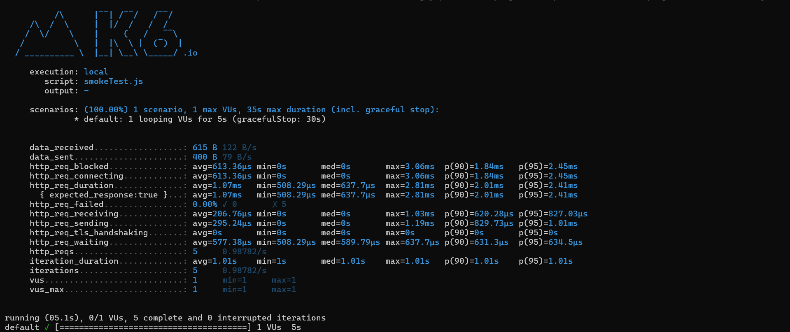
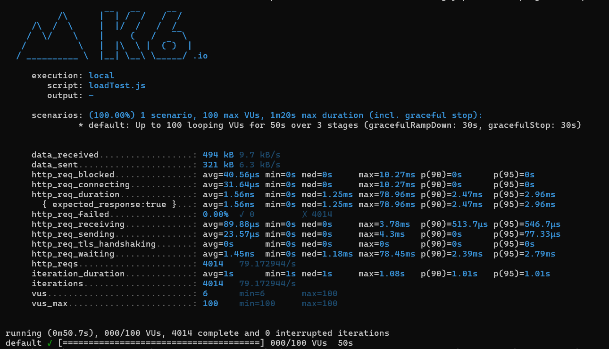
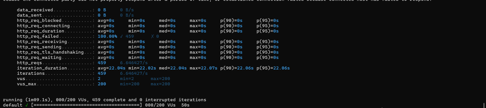
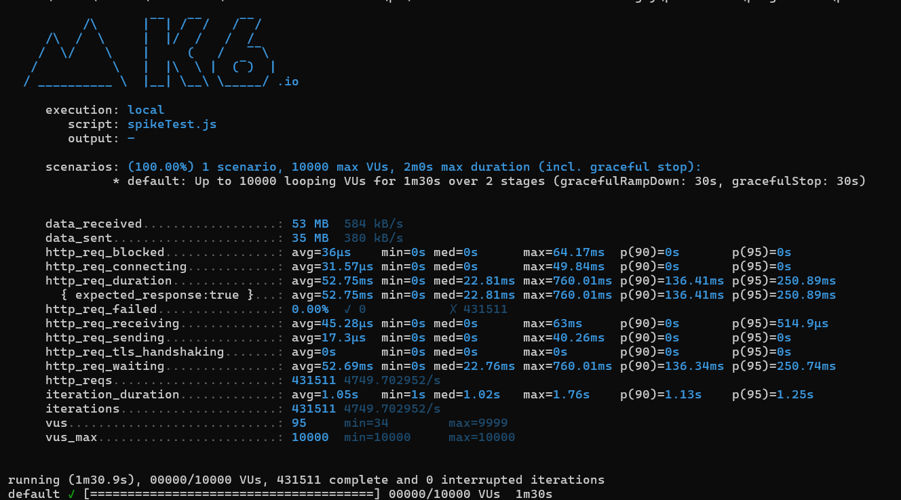

# Ponderada Semana 9 - Programação

* Essa ponderada tem como foco testar vários cenários dentro de uma aplicação utilizando K6.

## Etapa 1: criação da API básica para os testes:

```go
package main

import (
	"net/http"

	"github.com/go-chi/chi/v5"
	"github.com/go-chi/chi/v5/middleware"
)

func main() {
	r := chi.NewRouter()
	r.Use(middleware.Logger)
	r.Get("/", func(w http.ResponseWriter, r *http.Request) {
		w.Write([]byte("welcome"))
	})
	http.ListenAndServe(":3000", r)
}
```

## Etapa 2: Rodando teste de fumaça com o script smokeTest.js com a API golang ativa

```javascript
import http from "k6/http";
import { sleep } from "k6";

export const options = {
  vus: 1,
  duration: "5s",
};

export default function () {
  http.get('http://127.0.0.1:3000');
  sleep(1);
}
```

### Para testar, usaremos o comando: 

```bash
k6 run tests/smoke-test.js
```

### O resultado foi: 



#### Explicação: 

* O teste K6 foi executado localmente utilizando o script smokeTest.js com 1 usuário virtual (VU) durante 5 segundos. 

* O tráfego de rede envolveu 615 bytes de dados recebidos e 400 bytes enviados. 

* As requisições HTTP tiveram um tempo médio de 1.07 ms, com a mais rápida levando 508 µs e a mais lenta 2.81 ms, sem falhas reportadas (0% de falhas). 

* O tempo médio de espera das requisições foi de 577.38 µs, com a maioria sendo concluída dentro de 2 ms. 

* Cinco iterações foram realizadas, com cada iteração levando aproximadamente 1.01 segundos.

## Etapa 3: agora, iremos testar com vários estágios, conforme o código abaixo do loadTest.js: 

```javascript
import http from 'k6/http';
import { sleep } from 'k6';

export const options = {
    stages: [
        {
            duration: '10s',
            target: 100
        },
        {
            duration: '30s',
            target: 100
        },
        {
            duration: '10s',
            target: 0
        }
    ]
}


export default function () {
  http.get('http://127.0.0.1:3000');
  sleep(1);
}
```
*  Com esse teste, conseguimos simular o cenário de um ramp-up com o primeiro estágio. O teste rodará por 10 segundos, aumentando gradativamente o número de usuários até chegar a 100. Depois, ele rodará acessos com esses 100 usuários por 30 segundos e, por fim, levará mais 10 segundos para diminuir o número até chegar a zero.

### O resultado foi o seguinte: 



* O teste de carga foi executado localmente com o script loadTest.js simulando até 100 usuários virtuais (VUs) durante 50 segundos. 

* O total de dados recebidos foi de 494 kB e os enviados 321 kB. 

* O tempo médio de resposta das requisições HTTP foi de 1.56 ms, com o tempo mínimo sendo 0 ms e o máximo 78.96 ms. 

* Não houve falhas nas 4014 requisições realizadas (0% de falhas). O teste teve uma taxa de 79.17 requisições por segundo e foi executado com um número variável de usuários virtuais, indo de 6 até 100.


* De acordo com a definição deste tipo de teste, este é o comportamento esperado para nossa API. Estes são os valores mínimos que esperamos que nossa aplicação responda. Nos tópicos a seguir, testaremos os limites da aplicação.

## Etapa 4: Teste de estresse com o script stressTest.js:

```javascript 
import http from 'k6/http';
import { sleep } from 'k6';

export const options = {
    stages: [
        {
            duration: '10s',
            target: 200
        },
        {
            duration: '30s',
            target: 200
        },
        {
            duration: '10s',
            target: 0
        }
    ]
}

export default function () {
    http.get('http://127.0.0.1:3000');
    sleep(1);
}
```

### O Resultado foi: 



* Neste teste de estresse, o sistema foi submetido a um cenário com até 200 usuários virtuais (VUs) durante 50 segundos, distribuídos em 3 estágios. O teste gerou um volume considerável de dados: 987 kB recebidos e 642 kB enviados.

* As métricas principais mostram um tempo médio de resposta (http_req_duration) de 1,9ms, com picos de até 97,82ms. A maioria das requisições foi processada rapidamente, com 90% completando em até 3,12ms e 95% em até 4,74ms. Não houve falhas de requisições, com uma taxa de sucesso de 100%.

* O número total de requisições foi de 8.026, com uma taxa de 158,28 requisições por segundo. A duração média de cada iteração foi de aproximadamente 1,01 segundo. Durante o teste, o número mínimo de VUs foi 11, com o máximo chegando aos 200 configurados.

## Etapa 5: Teste com um pico seguido de queda (spikeTest.js)

```javascript 
import http from 'k6/http';
import { sleep } from 'k6';

export const options = {
    stages: [
        {
            duration: '1m',
            target: 10000
        },
        {
            duration: '30s',
            target: 0
        }
    ]
}

export default function () {
    http.get('http://127.0.0.1:3000');
    sleep(1);
}
```

### O resultado foi: 



* Neste teste de pico (spike test), o sistema foi submetido a até 10.000 usuários virtuais (VUs) em um cenário de 1 minuto e 30 segundos, com mais 30 segundos para o encerramento. O objetivo era testar a resposta do sistema sob carga extrema e rápida.

* Durante o teste, o sistema processou 431.511 requisições, com uma taxa média de 4.749 requisições por segundo. A latência média das requisições foi de 52,75ms, com 90% das requisições sendo concluídas em até 136,41ms e 95% em até 250,89ms. Nenhuma requisição falhou, o que indica uma boa estabilidade do sistema mesmo sob carga intensa.

* A quantidade de dados trocados foi significativa: 53 MB recebidos e 35 MB enviados. A duração média de cada iteração foi de 1,05 segundos, com variações mínimas e máximas entre 1s e 1,76s.

* O sistema lidou com sucesso com o pico de usuários, mantendo a performance dentro de limites aceitáveis.

## Etapa 6: Limite máximo que a aplicação suporta com breakPointTest.js

```javascript
import http from 'k6/http';
import { sleep } from 'k6';

export const options = {
    stages: [
        {
            duration: '2h',
            target: 100000
        }
    ]
}

export default function () {
    http.get('http://127.0.0.1:3000');
    sleep(1);
}
```


* O teste de breakpoint é complexo de observar apenas com o k6. Analisar como o servidor e a aplicação se comportam sob pressão é necessário, usando conceitos de observabilidade. Ao olhar os detalhes internos da aplicação, seremos capazes de entender se o breakpoint é a memória do servidor/cluster, se é o sistema de arquivos, o banco de dados, etc. Não terei dados para mostrar nos resultados deste teste, pois todos esses aspectos são necessários para a aplicação e infraestrutura, e isso está fora do escopo da atividade.

## Etapa 7: Teste de imersão com soakTesting.js

```javascript
import http from 'k6/http';
import { sleep } from 'k6';

export const options = {
    stages: [
        {
            duration: '5m',
            target: 1000
        },
        {
            duration: '24h',
            target: 1000
        },
        {
            duration: '5m',
            target: 0
        }
    ]
}

export default function () {
    http.get('http://127.0.0.1:3000');
    sleep(1);
}
```

* Da mesma forma que o teste Breakpoint, neste caso, também precisamos fazer uso da observabilidade para entender onde os problemas começam a aparecer depois de algum tempo sob essa pressão constante. Podem ocorrer dificuldades com vazamentos de memória e exaustão de recursos como memória, disco, banco de dados e até mesmo rede.
